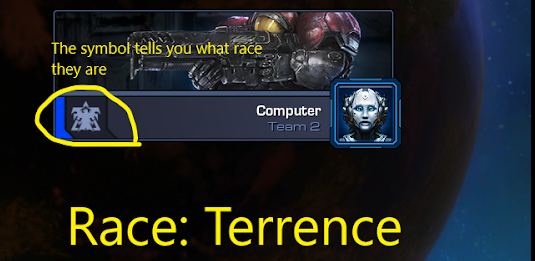
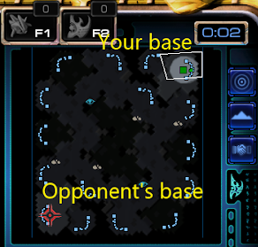

# **Starcraft II beginner guide for Protoss**

If you are wondering what StarCraft 2 is. StarCraft 2 is an RTS(Real-time strategy) game. The main idea is to destroy your opponent. you do that by moving units and building structures to overcome your opponent. But that&#39;s just the basic premise of the game. There&#39;s a lot more to Starcraft 2 than just destroying your opponent. like how to manage your resources, moving units, the counter to certain units, all the strategies in the game. These are some of the few things you need to know to play Starcraft 2. This tutorial expects you to understand the basic knowledge of Starcraft 2. If you haven&#39;t played the tutorial, here&#39;s a good video to watch to understand how the game works. [What is StarCraft? (Explanation for Complete Beginners)](https://www.youtube.com/watch?v=1-QtVxce44k&amp;t=0s)

# **The start of the tutorial**

1. when you load into your game you will be able to see what race your opponent is playing. You&#39;ll be able to tell because the enemy player will have a banner with a picture of their race.

2. After the countdown timer passes send a singular drone across the map to the opponent base so you can scout them out to see what their strategy is. 

1. what&#39;s assumed the opponent is going for a ground Army and with weak anti-air.

2. knowing the weakness of your opponent. You should start building infrastructure. so you can wager War. So you will want to secure your lower expansion And you probably won&#39;t want 4 vespene gas geysers.

3. now you will want to construct a gateway to spawn Basic Ground units. these ground units will be used in defense of your base.

build this amount of units.

. Zealot 3

. Stocker 3

. Sentry 1

Stats for basic defense units

| Name | HP | Minerals | Gas |
| --- | --- | --- | --- |
| Zealot | 50 | 100 | 0 |
| Stocker | 80 | 125 | 50 |
| Sentry | 40 | 100 | 100 |

6. now send your defense units to your lower expansion. The opponent will have to destroy your lower expansion to get your main base.

7. you will want to start making Stargates. you must have 3 start gates to mass Cruiser up. As further the game goes on you should be building more defense units to defend your base and some more zealots and stalkers.

8. By the 12 minute mark. you should have 10 Cruisers or so and some units you&#39;ve been using to defend your base. to make an assault.

9. In your case, this will be a defining moment if you win the game or lose it. by now your resources have run out on both of your expansions. so this will be your final Army. To win the game pretty much.

10. This will be the final step. All you do now. is Click F2 then press A and click on your opponent base. That should get you the win.

# **The ending of the tutorial**

What this guide was to show is one of the fun strategies to do inside of the Starcraft 2 Protoss race. it&#39;s a very good strategy for beginners. but this isn&#39;t the only strategy in Starcraft 2 for Protoss there&#39;s a bunch of them. it&#39;s a pretty easy-to-go strategy. so I recommend you watch this video. To get a better understanding of the game.

[How to get started with StarCraft 2 - Macro Tutorial - All Three Races (NEW 2020)](https://www.youtube.com/watch?v=OJs6qS5TQyo)